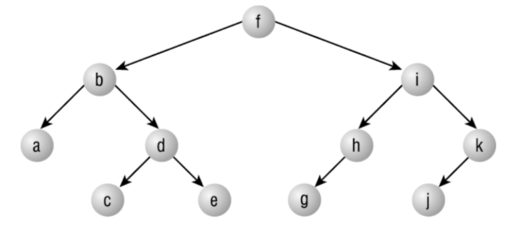

Basic Tree Nodes
---

Tree Nodes have an associated value and children. For these tree nodes, there are an arbitrary list of children (think Folders and Files, or DOM nodes).

## Challenge

For these problems, we'll use object literals for our tree nodes. Consider these nodes:

```js
const D = {
  value: 'D',
  children: []
};

const B = {
  value: 'B',
  children: [D]
};

const C = {
  value: 'C',
  children: []
};

const A = {
  value: 'A',
  children: [B, C]
};
```

### Part 1: Drawing Nodes

- Which of these nodes is the root?
- How do you know?
- Draw a tree diagram for these nodes similar to the diagram below:



### Part 2: Depth First Traversal

For this challenge, write a function that takes a node and console.logs the data value each node and then the data for each of its children, but indented two spaces. The function should be general and not specific to this instance. 

However, for the test case assume the structure is the same as above and your output should look like:

```
A
  B
    D
  C
```

Hints:
1. Use recursion. The "exit" is logging the node value.
1. Do the problem without the indentation first if that seems daunting. Remember you can add additional parameters to your function they may not be used on the initial call, but could have a default and then be used for subsequent calls
1. When your initial code solution is complete, try stepping through your code using a call stack to track the values
