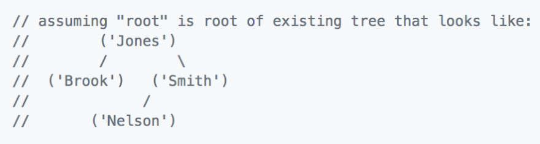

Binary Node Find Person
---

## Challenge

Implement the find method for this `PersonTreeNode` class, that takes a name and returns the that person object:

```js
class PersonTreeNode {
  constructor(person) {
    this.value = person.name;
    this.person = person;
    this.left = null;
    this.right = null;
  }

  add(node) {
    // implemented as in previous challenge
  }

  findPerson(name) {
    // Implement me!
  }
}
```

Keep in mind this is a recursive operation.

## Test Cases




```js
// "root" is the node at the root of the tree (the tree)
let person = root.find('Nelson');
// person is { name: 'Nelson'}

let person2 = root.find('Foo');
// person2 is null
```